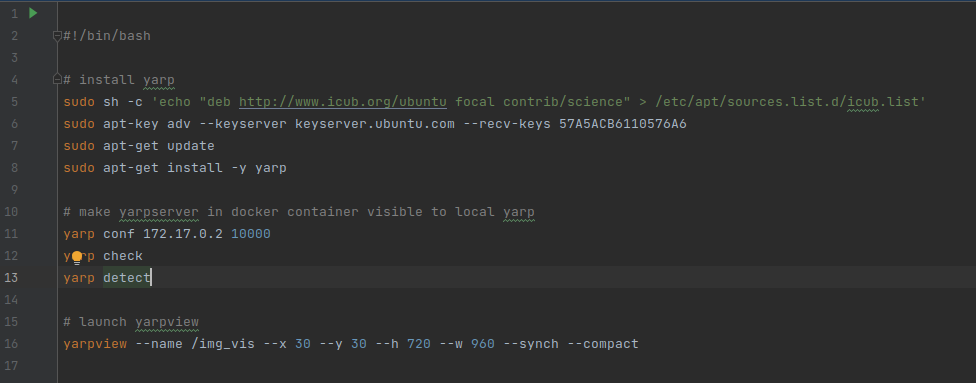

# Online OpenPose Example
A yarp application for online human pose estimation. The `YARP dataplayer` streams events to `e2vid_framer`, which creates 
batches of events and sends them to `E2Vid`. `E2Vid` predicts grayscale frames and sends them to `OpenPose` for pose estimation.
Raw events, grayscale frames and poses are sent to `vFramer` for the final visualization.

The application has been designed to run using docker for simple set-up of the environment.

## Files Description
- `Dockerfile`: file containing instructions for building a docker image able to run openpose and e2vid
- `e2vid_example_module.py`: python yarp module running E2Vid
- `e2vid_framer.cpp`: c++ yarp module creating batches of events that are sent to E2Vid
- `op_detector_example_module.cpp`: c++ yarp module running OpenPose.

The example contains also two c++ wrappers that call python code using Python's c++ api, `wrappers/e2vid.cpp` and 
`wrappers/e2vid.h`. Currently, it seems that PyTorch's `torch.device()` fails if YARP is included in c++.

## Installation
The software was tested on Ubuntu 20.04.2 LTS with an Nvidia GPU.

- Install the latest [Nvidia driver](https://github.com/NVIDIA/nvidia-docker/wiki/Frequently-Asked-Questions#how-do-i-install-the-nvidia-driver)
- Install [Docker Engine](https://docs.docker.com/engine/install/ubuntu)
- Install [Nvidia Docker Toolkit](https://docs.nvidia.com/datacenter/cloud-native/container-toolkit/install-guide.html#docker)
- Download the repository and build the Docker image
    ```shell
    $ cd <workspace>
    $ git clone git@github.com:event-driven-robotics/hpe-core.git
    $ cd hpe-core/example/op_detector_example_module
    $ docker build -t op-yarp --ssh default --build-arg ssh_pub_key="$(cat ~/.ssh/<publicKeyFile>)" --build-arg ssh_prv_key="$(cat ~/.ssh/<privateKeyFile>.pub)" - < Dockerfile
    ```
:bulb: `<workspace>` is the parent directory in which the repository is cloned

:bulb: The ssh keys are required to access hpe-core as it is currently private. [Create a new ssh key](https://docs.github.com/en/github/authenticating-to-github/connecting-to-github-with-ssh/generating-a-new-ssh-key-and-adding-it-to-the-ssh-agent) if required.

:warning: Ensure your ssh key is built without a passphrase.

## Live Atis Camera Usage
- Run the Docker container and, inside it, run the yarp manager and server
    ```shell
    $ xhost +
    $ docker run -it -v /tmp/.X11-unix/:/tmp/.X11-unix -e DISPLAY=unix$DISPLAY --runtime=nvidia <image_id>
    $ cd shell_scripts
    $ ./launch_yarp.sh
    ```
  In the ``yarpmanager`` window, load the configuration file ``yarpapp_demo_atis.xml`` (located in folder
  ``/usr/local/hpe-core/example/op_detector_example_module/conf``) and select the app ``e2vid_op_demo``.

  The terminal window will show ``yarpserver``'s IP address (``172.17.0.2`` in the figure below). This might be needed 
  for the next step.
  

- Open the script ``launch_yarpview.sh`` and check if line ``11`` has the correct IP address of ``yarpserver`` (gathered
  previously, figure below).
  If not, set the correct one.
  

- Run ``yarpview`` on the local machine (``yarpview`` cannot be currently run in the Docker container; this will be fixed in
  a future release)
    ```shell
    $ cd shell_scripts
    $ ./launch_yarpview.sh
    ```
  The script will also download and install locally ``yarp``.
  
- In the ``yarpmanager`` window, load the configuration file ``yarpapp_demo_atis.xml`` and select the app ``e2vid_op_demo``
 
- Run all components by clicking on the green button ``Run all``

- Setup Docker's image for running ATIS Gen3 camera by using [this](https://github.com/event-driven-robotics/atis-gen3-docker/tree/a7edfb2d5813b5edfdc68986a6384ec73cbc6af2) guide

- Once the camera is connected and running, activate all YARP connections by clicking on the green button ``Connect all`` in ``yarpmanager``'s GUI.

## OpenPose Parameters
List of available body models, joints and indices available [here](https://github.com/CMU-Perceptual-Computing-Lab/openpose/blob/master/src/openpose/pose/poseParameters.cpp).